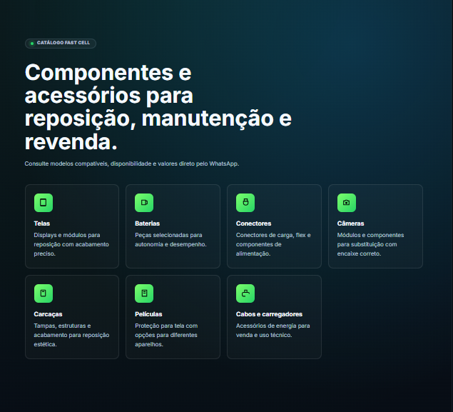
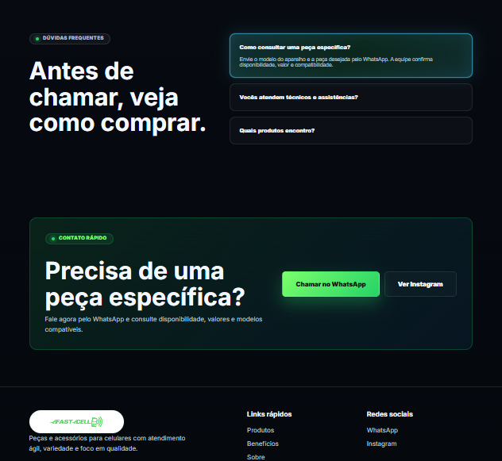

# Fast Cell | Landing Page

Landing page moderna e responsiva desenvolvida para a **Fast Cell**, loja especializada em peças, componentes e acessórios para celulares.

O projeto foi criado com foco em apresentação comercial, conversão via WhatsApp e uma experiência visual alinhada ao segmento de tecnologia e manutenção de smartphones.

## Preview

### Hero e chamada principal


### Catálogo de produtos



### Dúvidas, contato e rodapé



## Objetivo do projeto

Apresentar a Fast Cell como uma loja confiável para técnicos, assistências e clientes que precisam de peças de celular com agilidade, variedade e bom atendimento.

A landing page prioriza:

- Comunicação direta e comercial.
- Botões de contato via WhatsApp.
- Visual dark/tech com destaque em verde.
- Layout responsivo para celulares.
- Cards organizados para categorias de produtos.
- Seções de benefícios, dúvidas e contato rápido.

## Tecnologias utilizadas

- HTML5
- CSS3
- JavaScript
- Layout responsivo/mobile-first
- Git e GitHub
- Deploy via Netlify

## Principais seções

- Header com navegação e CTA para WhatsApp.
- Hero section com imagem principal e chamada comercial.
- Catálogo com categorias de peças.
- Benefícios para técnicos e assistências.
- Área sobre a empresa.
- Dúvidas frequentes.
- Chamada para contato rápido.
- Rodapé com links e redes sociais.

## Funcionalidades

- Menu responsivo para dispositivos móveis.
- Animações suaves ao rolar a página.
- Botão flutuante de WhatsApp.
- CTAs destacados para conversão.
- Layout adaptado para desktop e mobile.

## Como executar localmente

Clone o repositório e abra a pasta do projeto:

```bash
git clone https://github.com/CorreaVictorHugo/Landing_Page_Fast_Cell.git
cd Landing_Page_Fast_Cell
```

Como o projeto é estático, é possível abrir o arquivo `index.html` diretamente no navegador.

Também é possível rodar com um servidor local:

```bash
python -m http.server 4187
```

Depois acesse:

```text
http://localhost:4187
```

## Deploy

O projeto pode ser publicado em plataformas como:

- Netlify
- Vercel
- GitHub Pages

Configuração recomendada para Netlify:

- Build command: vazio
- Publish directory: `.`
- Branch de produção: `main`

## Autor

Desenvolvido por **Victor Hugo** como projeto de landing page comercial para portfólio e trabalhos freelancer.
